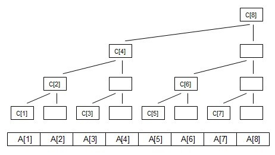

# 树状数组

## Oct 26, 2018, Chaigidel

***

###### 约定

$\lg x = \log_2 x$

***

###### 前缀和

有一数组 `a[n]`

定义 $sum[x] = \sum_{i=1}^{x} a_i$

显然，$\sum_{i=l}^r = sum[r]-sum[l-1]$

***

###### 构造



构造一个树型的结构，每个节点的值是子节点值的和

但我们 **只存** 一些特殊的点

***

###### 仔细观察


---

$g(x)$ 表示 $x$ 的二进制末尾0的个数

$lowbit(x)=2^{g(x)}$

---

第 $x$ 段区间长度为 $lowbit(x)$ ？

---

**大胆猜测，不用证明**

***

###### 构造出来了 可是有什么用呢

---

查询 `sum[6]`


***

###### 构造出来了 可是有什么用呢

查询 `sum[3]`


***

###### 构造出来了 可是有什么用呢

查询 `sum[7]`


---

似乎是每次加一个子树？ 子树覆盖的长度是多少？

---

$lowbit(x)$

---

```cpp
int ret;
for (; x > 0; x -= lowbit(x) )
    ret += c[x];
```

[https://visualgo.net/en/fenwicktree](https://visualgo.net/en/fenwicktree)

***

###### 代码写出来了 可是 lowbit 怎么求呢

我会位运算！

```cpp
int lowbit(int x){
    int ret = 1;
    while (!(x&1)){
        ret <<= 1;
        x >>= 1;
    }
    return ret;
}
```
---

看起来就很慢

---

```cpp
int lowbit(int x){
    return x&(-x);
}
```

蛤？

---

由于 $x>0$

举个例子

`x = 010011000` 第一位符号位

`+x` 补码是 `010011000`

`-x` 原码是 `110011000`

`-x` 反码是 `101100111`

`-x` 补码是 `101101000`

由于内部储存的是补码

`x & (-x) = 1000`

***

###### 我用前缀和直接搞定的事为啥用树状数组？

---

前缀和的动态修改复杂度为 $O(n)$

---

树状数组 $O(\lg n)$ !

---

举个栗子


修改 `a[6]` 只需修改 `c[6], c[8]`

修改 `a[1]` 只需修改 `c[1], c[2], c[4], c[8]`

修改 `a[3]` 只需修改 `c[3], c[4], c[8]`

---

似乎又和 `lowbit(x)` 有不为人知的关系？

---

```cpp
for (; x <= n; x += lowbit(x))
    c[x] += add;
```
[https://visualgo.net/en/fenwicktree](https://visualgo.net/en/fenwicktree)

***

###### 综上

```cpp
struct BIT{
    int c[N];
    int lowbit(int x){return x&-x;}
    void add(int pos, int x){
        for (int i = pos; i <= n; i += lowbit(i))
            c[i] += x;
    }
    int sum(int n){
        int ret = 0;
        for (int i = n; i > 0; i -= lowbit(i))
            ret += c[i];
        return ret;
    }
    int query(int l, int r){
        return sum(r) - sum(l-1);
}
```

***

###### 树状数组进阶

似乎现在树状数组只支持单点修改、区间查询？

如何支持区间加减、区间查询呢？

***

###### 差分

我们定义差分数组第 $i$ 项为 $m[i]=a[i]-a[i-1]$

显然有 $a[i] =\sum_{k=1}^i m[i]$

考虑一下区间加减？

---

若要把 $[l, r]$ 的数都加上 $v$

我们可以 $m[l] = m[l]+v$ , $m[r+1] = m[r+1]-v$

这样我们是不是就在 $O(1)$ 完成了区间修改？

---

但是我们查询的复杂度是 $O(n)$ 

考虑用树状数组优化

---

考虑查询 $[1, r]$

$ans = \sum_{i=1}^r \sum_{j=1}^{i}m[j]$

数形结合有利于直观证明（可是并没有图
$$
s =\sum_{i=1}^r m[i]
$$
由前面所讲，$s$ 可以轻易的用树状数组维护
$$
\begin{aligned}
ans &= \sum_{i=1}^r( s- \sum_{j=i+1}^{r}m[j]) \\
&= r\cdot s-\sum_{i=1}^r\sum_{j=i+1}^{r}m[j]\\
&=r\cdot s - \sum_{j=1}^r\sum_{i=1}^{j-1} m[j]
\end{aligned}
$$
于是我们又发现  $\sum_{j=1}^r\sum_{i=1}^{j-1} m[i]$ 好像是一个 $\sum_{j=1}^r$ 的前缀和加上一个 $\sum_{i=1}^{j-1} m[i]$ 和 $r$ 无关的式子构成

$t[j] = \sum_{i=1}^{j-1} m[j]$ 我们可以轻易的维护，当 $m[i] = m[i]+v$ 时 $t[j] = t[j]+(j-1)\cdot v$ 显然是 $O(1)$

然后我们再用一个树状数组快速求出 $\sum_{j=1}^rt[j]$
$$
ans=r\cdot s-t.sum(r)
$$

***

###### Code

```cpp
struct EXBIT{
    BIT t, s;
    void init(int pos, int add){
        s.add(pos, add);
        t.add(pos, (pos-1)*add);
    }
    void add(int l, int r, int x){
        s.add(l, x);
        s.add(r+1, -x);
        t.add(l, (l-1)*x);
        t.add(r+1, -r*x);
    }
    int _ask(int r){
        if (r <= 0) return 0;
        return r*s.sum(r) - t.sum(r);
    }
    int ask(int l, int r){
        return _ask(r) - _ask(l-1);
    }
};
```

