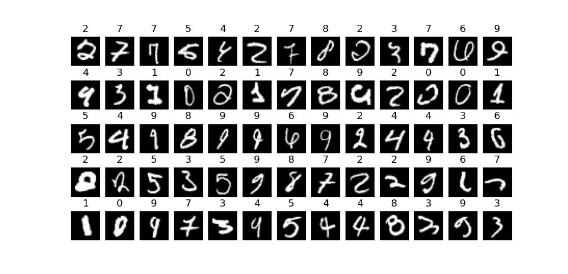

# 乱七八糟

## 我

- 水平很低
- 既不会线性代数，也不会微积分
- 讲原理是不可能的，求导又不会做，就是抄抄别人公式调调参，才可以维持得了生活这样子。
- 不会 CNN（Convolutional Neural Networks）

{height=50%}

## 内容

- 上个世纪的简单神经网络实现的手写数字识别
- 识别率大概在 $96\%$

~~据说每多一个数学式子就会有一半人去做作业？~~

欢迎拍砖

{height=73px}

## 数学基础

众所周知，$(i, j)$ 可以表示一个二维向量，$(i, j, k)$ 可以表示一个三维向量。

类似的， $a=(a_1,a_2,\dots,a_n)$ 可以表示为一个 $n$ 维向量。

注意向量也经常由一个 $n\times 1$ 矩阵表示。

$x,y$ 为 $n$ 维向量，定义

$$
x\cdot y=\sum x_iy_i\\
f(x)=(f(x_1),f(x_2),\dots,f(x_n))
$$

### 矩阵

矩阵大概长成这样

$$
A=\begin{bmatrix}
    a_{1,1} & a_{1,2} & \cdots & a_{1,n} \\
    a_{2,1} & a_{2,2} & \cdots & a_{2,n} \\
    \vdots & \vdots & \ddots & \vdots \\
    a_{m,1} & a_{m,2} & \cdots & a_{m,n}
\end{bmatrix}
$$

只需要理解矩阵**用来表示一种变换**，比如向量 $a$ 乘上一个矩阵 $w$ 可以得到一个新向量 $b=w\cdot a$，理解成 $b=f_w(a)$ 也可以。

---

$A$ 是 $m\times n$ 矩阵，$B$ 是 $n\times p$ 矩阵

$C=AB$ 是 $m\times p$ 矩阵

$$
C = (c_{ij}), ~~(1\le i \le m, ~1\le j \le p)\\
c_{ij} =\sum_{k=1}^n a_{ik}\times b_{kj}
$$

$C =c_{ij} = A$ 的第 $i$ 行逐个乘 $B$ 的第 $j$ 列

## 我们的目标

输入像素为 $28\times 28$ 的灰度数字图片，输出图片中的数字。

{height=100px} {height=100px}

# 什么是神经元

{width=30%} $~~~~~~~~~~~~~~~~~~~~~~~~$ {width=30%}

神经元得到向量 $x$ 作为输入，输出一个实数 $a=\sigma\left( \sum w_i\cdot x_i + b\right)$

它通过给 evidence 赋予不同权重从而作出决策。

## 一个栗子

你所在的城市将会举办一个奶酪节。你需要权衡以下几个因素来作出决定：

1. 天气好不好？
2. 你的男朋友或者女朋友会陪你去吗？
3. 坐公共交通方便去吗？

我们可以使用 $x_1,x_2,x_3$ 这几个二进制变量来表示这三个因素。比如，如果天气很好，那么我们令 $x_1=1$ ，否则如果天气不好，那么 $x_1=0$ 。同样地，如果你的男朋友或者女朋友也想去，那么 $x_2=1$ ，否则 $x_2=0$ 。代表公共交通的 $x_3$ 也用类似的方法来表示。

---

假设你真的超级喜欢奶酪，即便是你的男朋友或者女朋友的对此没兴趣并且交通也不方便的情况下，你也依然很想去。不过，你非常在意天气情况，如果天气不好的话你就不会去参加了。你可以用感知机来为这样的决策建立模型。一种方式是，你可以为天气赋予权重 $w_1=6$ ，为另外两个条件赋予权重 $w_2=2$ 和 $w_3=2$ 。相对来说值比较大的 $w_1$ 表明了天气情况对你的决策影响更大，胜过了你的男朋友或者女朋友是否会陪你去，以及交通的便捷程度。最后，假设你选择 $5$ 作为感知机的阈值。这样，这个感知机就构建起了一个决策模型，只要天气好就输出 $1$ ，只要天气不好就输出 $0$ 。你的男朋友或者女朋友是否会去，以及公共交通是否方便，都不会影响输出的结果。

---

通过调整权重和阈值的大小，我们可以得到不同的决策模型。例如，假设我们选择的阈值为 $3$ 。那么此时，如果要让感知机做出你应该去参加这个节日的决策，就需要满足天气很好或者交通方便的同时你的男朋友或者女朋友也会陪你去。也就是说，这个决策模型与之前不同了。阈值的降低意味着你参加这个节日的意愿越强。

## 更数学一些

$$
\sum_j w_j x_j > \textrm{threshold}
$$

为了简洁一些，把 threshold 转化为 bias，即 $b=-\textrm{threshold}$

把 $w,x$ 都看成向量，就会有

$$
\textrm{output} = \sigma(w\cdot x+b)
$$

约定 $z=w\cdot x+b,a=\textrm{output}=\sigma(z)$

---

可以把神经元看成函数 $f$，它自身有参数 $w,b$

$$
z=g(x)=w\cdot x+b\\
a=f(x)=\sigma(g(x))=\sigma(w\cdot x+b)
$$

---

{width=30%} {width=30%} {width=30%}

前文的 $\sigma$ 函数是第一个图

我们希望它连续一些，这样后期微分方便一些，于是就有第二个图 $\sigma(z) \equiv \frac{1}{1+e^{-z}}$ 。

据说 ReLU 也有很好的效果，也就是第三个图。

---

{width=30%}\

$\sigma$ 函数的平滑属性才是其关键，不用太在意它的具体代数形式。 $\sigma$ 函数的平滑属性意味着当我们在权值和偏置上做出值为 $\Delta w_j$ ， $\Delta b$ 的轻微改变时，神经元的输出也将只是轻微地变化 $\Delta \text{output}$ 。事实上，

$$
\Delta \textrm{output} \approx \sum_j \frac{\partial \, \textrm{output}}{\partial w_j} \Delta w_j + \frac{\partial \, \textrm{output}}{\partial b} \Delta b
$$

# 什么是神经网络

~~一群神经元连起来就是了，还用你讲？~~

{height=50%}

神经网络由输入层，隐藏层（可以有多个），输出层组成。

实际上是许多神经元按照一定方法复合形成。

---

{height=50%} 定义总层数为 $L$，定义第 $l$ 层

- 神经元有 $s^l$个
- 第 $j$ 个神经元，$z^l_j$ 和 $a^l_j=\sigma(z^l_j)$ 的定义仿照神经元
  - $z^i=(z^i_1,\cdots,z^i_{s_i}),a^i=(a^i_1,\cdots,a^i_{s_i})$
- bias 为 $b^l$
- 转移矩阵 $w^l$ 大小为 $s^l\times s^{l-1}$

---

注意到每个第 $l$ 层第神经元都会和每个第 $l-1$ 层的神经元充分连接。

$w^l_{jk}$ 表示第 $i$ 层，第 $j$ 个节点，会对来自第 $i-1$ 层，第 $k$ 个节点的权值乘 $w_{jk}$

换言之，对于每个节点，$z^l_j=\sum_k w^l_{jk}a^{l-1}_k + b^l_j$

若把节点换成层，我们可以用矩阵乘法描述这种变换，会有一个优美的式子

$$
a_l=\sigma(w_{l-1}a_{l-1}+b_{l-1})=\sigma(z_l)
$$

这样，只要由输入和神经网络就能求出输出

---

```python
class Network(object):

    def __init__(self, sizes): # 随机初始化
        self.n, self.sizes = len(sizes), sizes
        self.bias = [np.random.randn(y, 1) for y in sizes[1:]]
        self.weight = [np.random.randn(y, x)
                  for x, y in zip(sizes[:-1], sizes[1:])]

    def feedforward(self, a): # 输入 a，返回输出
        for w, b in zip(self.weight, self.bias):
            a = sigmoid(np.dot(w, a) + b)
        return a
```

# 反向传播

## 你说了这么多可是我觉得你在 BB

一个数字图片像素是 $28\times 28=784$

假设有 $5$ 层节点数为 $100$ 的隐藏层，最后有节点数为 $10$ 的输出层，那么 

$w$ 有 $728\times 100+4\times100\times100+100\times10=113800$ 个参数

$b$ 有 $5\times100+10=510$ 个参数

这么多参数谁来算？

{height=75px}

---

{height=120px}

**当然是让机器自己算！**

## 学习

再总结一下我们的上面的工作，我们获得一个图像，我们可以用一个 $728$ 维灰度向量 $x$ 表示它。

然后构造了一个拥有 $114310$ 个参数的函数（神经网络），接受 $x$，返回结果。

我们的问题变成如何**优化**这些数量巨大的参数。

{height=100px}

---

更具体一些，我们现在已知很多图像和它们对应的数字（训练集）

对于一个训练样本，输出为 $x$，期望输出为 $y$ 构造代价函数

$$
C_x=\frac{1}{2}(y-a^L)^2
$$

把神经网络看作函数 $F$，它的参数记为 $w_1,w_2,\dots,w_n$

代价函数实际上是 $C_x(w)\rightarrow\text{糟糕程度}$

---

更详细地说，$a^L=F(x)$

$$
C_F(x)=\frac{1}{2}(y-F(x))^2
$$

由于 $x,y$ 是固定的，把变量和参数换一下

$$
C_x(F)=\frac{1}{2}(y-F(x))^2
$$

$C_x$ 的参数 $F$ 实际上是 $w_1,\dots,w_{114310}$

---

于是这就变成了常规的最优化问题，就是优化 $w$ 使得 $C_x(w)$ 降低。

## 梯度下降

$C(w_1,w_2,\dots,w_{114310})$ 过于复杂，为了说明问题，先把变量降到一维

接下来讨论 $C(w)$ $w$ 是一个实数

### 更数学一些

{width=70%}

斜率 $k=\partial C / \partial w$

- $k>0$ 那么就把 $w$ 往左移动一点
- $k<0$ 那么就把 $w$ 往右移动一点

---

对于 $C(w_1,w_2,\dots,w_{114310})$ 并没有本质区别

只需要求出
$\partial C / \partial w_{1},\partial C / \partial w_{2},\dots,\partial C / \partial w_{114310}$

## 反向传播的数学推导（选听）

如果你对数学并不感兴趣，你只需要把反向传播算法理解为求偏导数和修正量的奇妙黑箱

~~我会给你们讲我也不会偏微分就只是大概讲一讲感性推导？~~

{height=100px}

### 重申一下定义

{height=45%} 定义总层数为 $L$，定义第 $l$ 层

- 神经元有 $s^l$个
- 第 $j$ 个神经元，$z^l_j$ 和 $a^l_j=\sigma(z^l_j)$ 的定义仿照神经元
  - $z^i=(z^i_1,\cdots,z^i_{s_i}),a^i=(a^i_1,\cdots,a^i_{s_i})$
- bias 为 $b^l$
- 转移矩阵 $w^l$ 大小为 $s^l\times s^{l-1}$

---

{height=50%}

对于第 $l$ 层第 $j$ 个神经元

$$
z^l_j=\left(\sum_k w^l_{jk}a^{l-1}_k\right)+b^l_j\\
a^l_j=\sigma(z^l_j)
$$

---

讨论第 $L$ 层（输出层）

$$
\begin{aligned}
C&=\frac{1}{2}(y-a^L)^2\\
a^L&=\sigma(z^L)\\
z^L&=w^L\cdot a^{L-1}+b^L
\end{aligned}
$$

#### 第一个等式

定义 $\delta^l_j \equiv \frac{\partial C}{\partial z^l_j}$

---

$$
\begin{aligned}
\text{根据链式法则 }
\delta^l_j &\equiv \frac{\partial C}{\partial z^l_j}\\
&= \frac{\partial C}{\partial a^L_j}\cdot \frac{\partial a^L_j}{\partial z^L_j}\\
&= \frac{\partial C}{\partial a^L_j}\cdot \sigma'(z^L_j)\\
\text{矩阵形式 } \delta^L& = (a^L-y) \odot \sigma'(z^L)
\end{aligned}
$$

#### 第二个等式

把第 $l+1$ 层的 $\delta$ 推到第 $l$ 层

$$
\delta^l = ((w^{l+1})^T \delta^{l+1}) \odot \sigma'(z^l)
$$

#### 第三个等式

$$
\begin{aligned}
\frac{\partial C}{\partial b^l_j}
&=
\frac{\partial C}{\partial z^l_j}
\cdot
\frac{\partial z^l_j}{\partial b^l_j}\\
&=\delta^l_j
\end{aligned}
$$

#### 第四个等式

$$
\begin{aligned}
\frac{\partial C}{\partial w^l_{jk}}
&=
\frac{\partial C}{\partial z^l_j}
\cdot
\frac{\partial z^l_j}{\partial w^l_{jk}}\\
&= \delta^l_j \cdot a^{l-1}_k
\end{aligned}
$$

## 反向传播的代码实现

```python
def backprop(self, x, y):
    # 算出每一层的 a, z
    activation, activations = x, [x]
    zs = []
    for b, w in zip(self.bias, self.weight):
        z = np.dot(w, activation) + b
        zs.append(z)
        activation = sigmoid(z)
        activations.append(activation)
    nabla_b = [np.zeros(b.shape) for b in self.bias]
    nabla_w = [np.zeros(w.shape) for w in self.weight]
    # 第一个等式
    delta = self.cost_derivative(activations[-1], y) * \
            sigmoid_prime(zs[-1])
    nabla_b[-1] = delta # 第三个等式
    nabla_w[-1] = np.dot(delta, activations[-2].transpose()) # 第四个等式
    for l in range(2, self.num_layers):
        z = zs[-l]
        sp = sigmoid_prime(z)
        delta = np.dot(self.weight[-l+1].transpose(), delta) * sp
        nabla_b[-l] = delta
        nabla_w[-l] = np.dot(delta, activations[-l-1].transpose())
    return (nabla_b, nabla_w)
```

# 完成！

再来总结一下流程

```python
import mnist_loader
import network
# 加载训练数据
training_data, validation_data, test_data = mnist_loader.load_data_wrapper()
# 创建网络
net = network.Network([784, 30, 10])
# 训练
net.SGD(training_data, 2, 10, 3.0)
# 测试
net.evaluate(test_data)
```

## 调参魔法

### 一 核 有 难 ，七 核 围 观

先整个活

{height=120px} {height=75px}

### 中间层节点是不是越多越好呢

{height=70%}

由于算力不够，$Epoch$ 只能取到 $40$

### 层数是不是越多越好呢

{height=70%}

---

{height=70%}

### $\eta$ 玄学调参

{height=70%}

容易发现，当 $\eta$ 过小，训练速度显著降低，并且会困在局部最优。

~~按道理说 $\eta$ 过大的时候应该会炸，结果没有~~

### 总结

就数据来看，单层 $70$ 节点达到了最高的识别数 $9637$

实际上并没有多次实验，而且玄学只是玄学

{height=75px}

#### 这是一些识别失败的栗子


---


---



---


---


# 鸣谢

感谢听这么菜的我说废话

{height=100px}

## Ref

- *But what is a Neural Network?*
- *Gradient descent, how neural networks learn*
- *What is backpropagation really doing?*
- *Backpropagation calculus*

By **3Blue1Brown**

*Neural Networks and Deep Learning* By **Michael Nielsen**

{height=75px}
